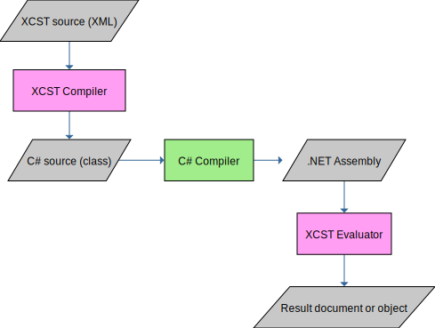

XCST programs are called **packages** (not to be confused with NuGet packages). Packages are XML documents rooted at [`c:module`](../c/module.html) or [`c:package`](../c/package.html).

The execution of a package consists of three separate processes: [code generation](code-generation.html), compilation and [evaluation](evaluation.html).

The code generation process takes an XCST package and produces C# source code. The resulting C# code consists of a single class that is a pure C# version of your XCST program.

The compilation process takes the C# source and produces a **compiled package**. This process is **not** implemented by this project, you have to invoke the C# compiler yourself, or use an IDE like Visual Studio. The C# code can be included in your existing project, see [Code Generation: MSBuild](code-generation.html#msbuild).

The evaluation process takes an instance of your compiled package and produces a result document or object.

## ASP.NET

This project provides integration with ASP.NET which includes its own build infrastructure. By using the `Xcst.AspNet` NuGet package you can simply add XCST pages to your site and the framework takes care of code generation and compilation at run-time.

For legacy projects you can use the `Xcst.Web.Mvc` NuGet package which implements an XCST view engine for ASP.NET MVC.
